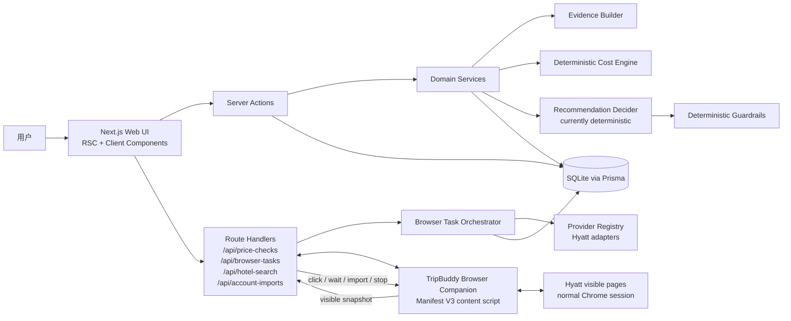
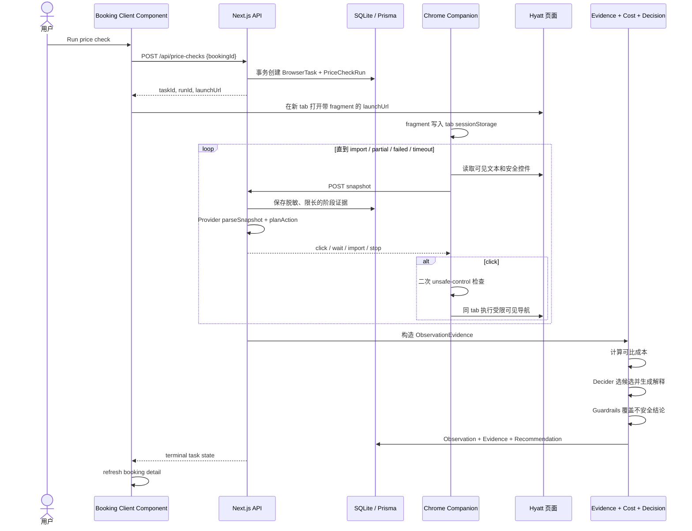
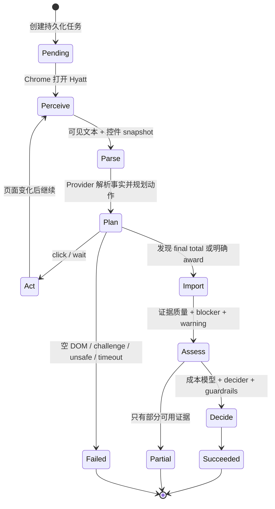
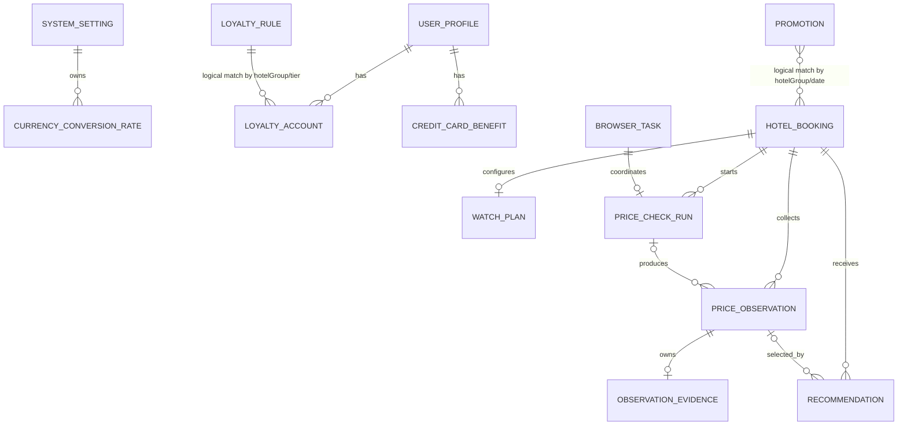
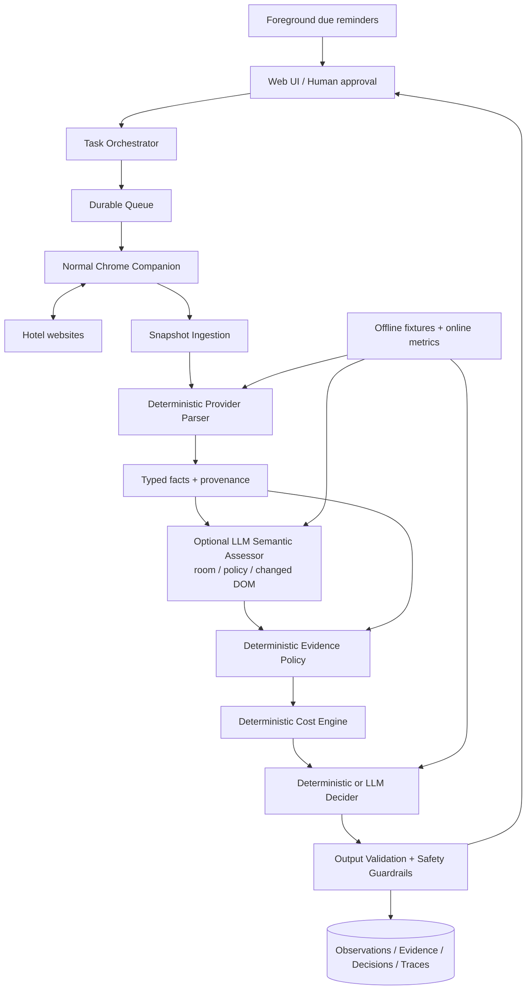

# TripBuddy 当前系统设计与 AI Agent 面试讲解指南

> 代码基线：`main` / `6281b62`（2026-08-02）  
> 项目阶段：v0.2 开发中  
> 文档目标：说明当前真实实现、系统设计取舍、AI Agent 面试讲法，以及下一阶段的完善方向。

## 0. 先说结论

TripBuddy 是一个 **local-first 的酒店预订优化工作台**。它不是 OTA，也不替用户下单。它围绕已有或候选酒店订单，使用用户正常 Chrome 会话中的可见页面证据，采集酒店官网的现金价、积分价、税费、房型和取消政策，再把这些事实转换为可审计的证据、可比成本和换订建议。

当前项目最值得讲的不是“做了一个酒店价格爬虫”，而是下面这条完整闭环：

1. 前端创建一个持久化 Browser Task；
2. Chrome Companion 在真实登录会话中感知可见 DOM；
3. 服务端规划下一步安全动作，扩展只负责受限执行；
4. 采集结果先经过事实解析和证据质量评估；
5. 金额、积分、权益和促销统一进入确定性成本模型；
6. 决策器给出候选方案，最终仍由 deterministic guardrails 兜底；
7. 用户确认后才更新当前预订基线，系统永不自动支付、取消或确认预订。

需要诚实说明：**当前没有接入 LLM，也没有运行中的 scheduler。** 现在是一个有状态、可执行、带安全边界的 deterministic browser agent / agentic workflow；代码已经为未来的 LLM decider 留出了接口，但不能在面试中说成“已经用大模型完成自主决策”。

---

## 1. 产品边界与当前完成度

| 能力 | 当前状态 | 说明 |
|---|---|---|
| 手工创建和编辑酒店预订 | 已实现 | 支持现金、积分、免房券三类 baseline |
| 手工录入价格观察 | 已实现 | 支持现金、积分 + copay、房型、税费、取消政策和人工纠正 |
| Hyatt 订单导入 | 已实现，需真实浏览器回归 | 从 My Stays 收集 Stay Details，再逐个打开详情页；只导入 check-in 为今天或未来的订单 |
| Hyatt 已有订单价格检查 | 已实现，需真实浏览器回归 | 支持现金和积分库存，只有 final/detail cash total 才进入 observation |
| Hyatt 城市搜索 | 已实现，存在一个扩展运行时问题 | 起价与 booking recommendation 分离；可按酒店继续获取含税费总价 |
| 证据质量和人工纠正 | 已实现 | blocker、warning、quality、assessment source 均落库 |
| 确定性可比成本与推荐 | 已实现 | 支持现金、积分、促销、信用卡、会籍进度和权益估值 |
| Provider 插件化边界 | 已实现 | 当前 registry 里只有 Hyatt |
| OTA / 非 Hyatt 采集 | 未实现 | 数据模型预留，UI 不应把未实现 provider 显示为可用 |
| 到期检查 | 前台队列 | Dashboard 打开时按 cadence 计算到期项；用户点击后才启动正常 Chrome，不支持后台调度 |
| LLM 决策 | 未实现 | `RecommendationDecider` 可替换，当前使用 deterministic v2 |
| 自动订房、取消、支付 | 明确不做 | 属于产品安全边界，不是遗漏 |

---

## 2. 技术栈

### 2.1 前端

| 层 | 技术 | 当前用法 |
|---|---|---|
| Web framework | Next.js 15 App Router | 页面、Route Handlers、Server Actions 在同一项目中 |
| UI | React 19 + TypeScript 5 | Server Components 为主，交互区使用 Client Components |
| Server Components | Next.js RSC | Dashboard、booking detail、profile、promotions 等直接通过 Prisma 读取本地数据 |
| Client Components | React hooks | 启动浏览器任务、打开 Hyatt tab、每秒轮询任务状态、刷新页面 |
| 表单写入 | Next.js Server Actions | 预订、观察、profile、promotion、watch plan 的增改 |
| 样式 | 原生 CSS | 单一 `globals.css`，没有额外 UI framework |

主要页面：

- `/`：活跃预订、最新建议、Hyatt 账户导入；
- `/bookings/[id]`：当前 baseline、最近观察、证据质量、建议和人工确认；
- `/hotel-search`：官方城市价格与单酒店含税总价；
- `/profile`：用户估值偏好、酒店会籍和信用卡权益；
- `/promotions`：手工促销库；
- `/settings`：local-first 和浏览器接入状态。

### 2.2 后端与数据层

| 层 | 技术 | 当前用法 |
|---|---|---|
| 服务端运行时 | Next.js Route Handlers + Server Actions | API 适配器、任务生命周期和领域写入 |
| ORM | Prisma 6 | 类型化数据访问、事务、migration 和 seed |
| 数据库 | SQLite | 单机、本地、单用户数据存储 |
| 异步任务 | 数据库持久化 Browser Task + 前端 polling | 没有 Redis、消息队列或独立 worker |
| Provider 层 | TypeScript interface + registry | Hyatt URL、页面规划、解析和账户导入逻辑封装在 provider 内 |
| 决策层 | 纯 TypeScript deterministic engine | 成本公式、候选选择、运行时输出校验和安全 guardrails |

### 2.3 浏览器执行层

| 层 | 技术 | 当前用法 |
|---|---|---|
| 浏览器 | 用户正常 Chrome | 复用真实登录态，不读取或复制用户凭据 |
| 扩展 | Chrome Extension Manifest V3 + 原生 JavaScript | Content Script 读取可见 DOM、收集可交互控件、执行批准后的导航 |
| 任务上下文 | URL fragment + tab `sessionStorage` | `taskId` 和 local endpoint 不需要发送给 Hyatt server |
| 通信 | 本地 HTTP JSON API | 扩展 GET 任务、POST snapshot；本地应用持久化状态和结果 |

### 2.4 工程质量

- Vitest 3 + Testing Library + jsdom；
- ESLint 9 + Next.js rules；
- TypeScript strict mode；
- Prisma migration 与 seed；
- 当前验证结果：**18 个测试文件、83 个测试通过，lint、typecheck、production build 均通过**。

---

## 3. 总体架构



这套架构有四个明确边界：

1. **UI / API adapters**：接收表单、创建任务、轮询状态，不复制领域规则；
2. **Provider adapters**：处理 Hyatt 特有 URL、页面结构、解析和导航策略；
3. **Evidence + pricing services**：把事实变成可比较证据和确定性成本；
4. **Decision boundary**：可以替换决策器，但最终输出必须通过 deterministic guardrails。

### 3.1 前后端边界

当前不是传统的“独立 SPA + REST backend”，而是 Next.js full-stack monolith：

- 读路径主要是 Server Components 直接访问 Prisma；
- 普通写路径主要是 Server Actions；
- 只有跨 tab、跨 Chrome extension 的浏览器任务使用 Route Handlers；
- 少量 Client Components 负责 `window.open`、轮询、局部状态和 `router.refresh()`。

这个形态适合当前单用户、local-first 阶段：部署简单、领域逻辑集中、没有多服务通信成本。若未来变成多用户云服务，再拆 worker、queue 和独立 task service 更合理。

---

## 4. 核心 Agent 链路

### 4.1 Booking price check 时序



### 4.2 浏览器 Agent 的感知—规划—执行循环



Agent 能力与代码映射：

| Agent 概念 | 当前实现 |
|---|---|
| Perception | Content Script 读取用户可见 DOM、页面标题、URL 和可见控件 |
| State / memory | SQLite `BrowserTask`、`PriceCheckRun`、最多 12 个脱敏 snapshot；tab `sessionStorage` 保存导航上下文 |
| Planning | `planBrowserAgentAction` 基于页面阶段和控件语义返回 `click / wait / import / stop` |
| Tool use | 扩展在真实 Chrome 中点击受限控件、同域导航、读取结果 |
| Environment feedback | 每次 DOM 变化重新 snapshot，再由服务端重新规划 |
| Safety policy | 服务端规划边界 + 扩展 unsafe denylist + 只到 pre-payment summary |
| Long-term audit | Observation、Evidence、Recommendation、decision provider/version 全部持久化 |
| Human in the loop | 人工修正房型/取消政策；用户自行完成换订并确认新 baseline |

### 4.3 三类 Browser Task

| Task kind | 输入 | Agent 行为 | 持久化结果 |
|---|---|---|---|
| `booking_price_check` | 已有 booking + watch plan | 查现金/积分库存，安全进入 final detail | PriceCheckRun、Observation、Evidence、Recommendation |
| `hotel_search` | 城市、日期、人数、profile currency | 切换并验证页面币种，采集 Avg/Night；可继续到单酒店含税总价 | BrowserTask result；不写 booking observation |
| `account_booking_import` | Hyatt My Stays | 先收集 Stay Details URL，再直接逐个打开详情 | upsert active HotelBooking；支持 cash / points / certificate baseline |

---

## 5. 数据设计



关键建模选择：

- `HotelBooking` 保存用户当前 baseline，而不是每次采集都覆盖；
- `PriceObservation` 只存事实，不直接存结论；
- `ObservationEvidence` 单独存 comparability、来源、blocker、warning 和人工/自动 assessment provenance；
- `Recommendation` 保存 cost breakdown、decision provider/version 和当时的解释，便于审计历史；
- `BrowserTask` 与 `PriceCheckRun` 分开：前者描述跨浏览器执行，后者描述业务价格检查；
- 不同 shape 的 provider context、snapshot 和 cost breakdown 目前以 JSON string 保存，换取 v0.2 的开发速度。

---

## 6. 证据、成本与决策设计

### 6.1 为什么不把网页抓到一个价格就直接推荐

TripBuddy 把页面信息分为三个阶段：

1. **Inventory**：房间列表、Avg/Night、积分库存；
2. **Selection**：选择酒店、房间和 rate plan；
3. **Detail**：final total、Taxes & Fees、房型、早餐和取消政策。

现金房的 Avg/Night 只进入本次 run 的 inventory evidence，不直接成为用户可见 observation。现金 observation 原则上必须来自 final/detail total；明确的积分价可以进入 observation，但如果房型或政策未知，结论仍是 `needs_review`。

这解决的是一个很实际的问题：网站列表价可能缺税、缺 fee、按每晚展示，或者不是同房型。系统宁可少给自动建议，也不把不完整数字包装成“省了多少钱”。

### 6.2 Evidence quality

证据构建器输出：

- `roomMatch`：exact / similar / unknown；
- `cancellationMatch`：same_or_better / worse / unknown；
- taxes、fees、loyalty、currency comparability；
- `blockers` 与 `warnings`；
- `qualityLevel`：high / medium / low / needs_review；
- 每个 assessment 是 automated 还是 user correction。

硬 blocker 包括：房型未知、取消政策可比性未知、现金税费未确认、缺少币种转换。带 blocker 的候选即使看起来很便宜，也不能被最终 guardrail 输出为自动换订建议。

### 6.3 确定性成本模型

当前有效成本可概括为：

```text
effectiveCost
= cashPrice
+ redemptionPointsValue
- earnedPointsValue
- promotionValue
- creditCardValue
- eliteProgressValue
- benefitValue
```

其中权益价值来自用户 profile，例如早餐、lounge、late checkout、upgrade 和 elite night 的主观估值。现金与积分不是直接比数字，而是统一投影到 profile 的主要计算币种。

### 6.4 可替换 Decider 与不可替换 Guardrails

`RecommendationDecider` 的输入只包含结构化 booking、候选、成本和 profile，输出候选 ID、verdict、risk、estimated savings 和 explanation。

当前 `DeterministicRecommendationDecider` 的大致顺序是：

1. 优先选没有 blocker 的候选；
2. 再按有效成本节省排序；
3. 临近取消截止时间则标记 urgent；
4. 有 blocker 则 needs_review；
5. 安全的 direct 候选超过 threshold 才建议 rebook_direct；
6. 否则 keep。

即使未来 LLM 返回了错误候选、虚构 savings 或在有 blocker 时建议换订：

- runtime validator 会检查输出结构和枚举；
- candidate ID 必须来自输入集合；
- savings 会被确定性成本结果覆盖；
- blocker 会强制把 rebook/OTA 建议降级为 `needs_review`。

这是面试里很重要的设计原则：**LLM 可以参与语义判断和解释，但不拥有金额真值，也不能越过安全策略。**

---

## 7. 从 AI Agent 面试角度怎么定义这个项目

### 7.1 推荐说法

> 我做的是一个 local-first 的酒店价格优化 Agent。它通过浏览器扩展进入用户正常 Chrome 会话，持续执行“感知页面—服务端规划—受限操作—再次感知”的闭环。系统不会让模型或扩展直接做最终交易，而是先把网页事实标准化为带 provenance 的 evidence，再用确定性成本引擎比较现金、积分、促销和会籍权益。当前 planner 和 decider 是 deterministic 的，但决策边界已经为 LLM 预留，并且任何模型输出都必须通过 deterministic guardrails。

### 7.2 不推荐说法

- 不要说“已经用 LLM 自动订酒店”；当前没有 LLM，也从不自动下单。
- 不要说“全自动定时监控”；cadence 只生成 Dashboard 前台队列，`due_queue` trigger 记录来源，检查仍由用户点击启动。
- 不要说“支持所有酒店集团和 OTA”；当前浏览器 provider 只有 Hyatt。
- 不要只说“我写了个爬虫”；这会丢掉 task orchestration、证据、成本、guardrail 和 human-in-the-loop 的价值。

### 7.3 为什么它仍然有 Agent 含量

Agent 不等于“必须调用 LLM”。当前系统已经有：

- 明确目标：为一笔 booking 找到更优且可比较的候选；
- 环境感知：从动态网页获取新状态；
- 有状态循环：跨页面、跨多次 snapshot 持续推进；
- 动作空间：click / wait / import / stop；
- 工具执行：真实 Chrome 与酒店页面；
- 长短期记忆：sessionStorage + persistent task/run/evidence；
- 安全约束和人工确认。

更准确的定位是：**当前是 deterministic agentic system，下一阶段可以升级为 hybrid LLM agent。**

---

## 8. 面试中最值得展开的亮点

### 8.1 真实浏览器会话，而不是偷拿凭据

难点是 Hyatt 的会员价和账户订单依赖真实登录态，同时页面可能有反自动化、动态 DOM 和挑战页。项目没有保存 Hyatt 账号密码，也没有复制 Chrome profile，而是让用户从本地应用主动打开任务，在正常 Chrome 中由 Companion 读取可见证据。

可讲的 trade-off：

- 优点：复用用户已登录会话、行为可见、隐私边界清楚；
- 代价：扩展安装和用户开 tab 的摩擦更大，页面变化也需要持续适配；
- 选择理由：对涉及账户和可能进入支付前页面的 agent，透明性与安全性优先于“无感自动化”。

### 8.2 Planner 与 Executor 分离

服务端根据 snapshot 规划动作，扩展只执行受限动作；两侧都拒绝 payment / confirm / purchase / complete reservation 等终态控件。这比让 content script 自己包含全部业务逻辑更容易审计，也便于以后让 LLM 只“提议动作”，再由 policy engine 验证。

### 8.3 Evidence-first，而不是 answer-first

系统把“抓到了什么”和“应该怎么做”分开：Observation 是事实，Evidence 是可比性判断，Recommendation 是业务结论。每层都可以单独回放和测试。用户纠正也不会伪装成自动判断，而是有 assessment source。

### 8.4 确定性核心包住概率模型

即使未来加入 LLM，也不让它做汇率、积分价值、税费加总和最终 safety decision。LLM 最适合补足的是非结构化语义：房型等价、取消条款归类、页面变化后的候选动作、自然语言解释。

### 8.5 Provider contract 支持逐步扩展

`BookingPriceProvider`、`HotelSearchProvider`、`AccountBookingImporter` 把 provider-specific 逻辑隔离出来；UI 只显示真正实现了接口的 provider。扩展 Marriott / Hilton 时，核心 evidence 和 decision 层无需重写。

### 8.6 失败也是一等状态

空 DOM、challenge、E6020、超时、币种未切换、缺税费都不是“没有房”或“价格为 0”，而是 failed / partial / needs_review。旧 observation 不会因为新任务失败而被清空，run 也不会永久停在 running。

---

## 9. 当前不足与优先级

以下不是泛泛而谈的 roadmap，而是基于当前代码的具体审查结果。

### P0：下一次真实演示前

| 问题 | 当前影响 | 建议 |
|---|---|---|
| 城市搜索扩展存在 `task` 作用域错误 | `runHotelSearchTask()` 读取 `task.hotelSearchMode`，但 `task` 只定义在 `runCurrentTask()` 的局部作用域；请求指定币种时可能直接 `ReferenceError` | 显式把完整 task 或 `hotelSearchMode` 传入函数；为扩展流程写可执行单测，而不是只做 source-string assertion |
| Dashboard 的动态数据缓存策略需要验证 | production build 把 `/` 标为 static；账户导入通过 Route Handler 写 DB，只调用 `router.refresh()`，没有显式 `revalidatePath("/")` | 把依赖实时 DB 的页面明确设为 dynamic，或在 API 完成后统一 revalidate；用真实导入流程验证 UI 立即刷新 |
| 缺少本次代码基线的真实 Hyatt acceptance 证据 | 单测和 build 通过不等于第三方动态页面仍然可用 | 严格按仓库约束，用正常 Chrome + Companion 从 app 页面验证 booking check、city currency + tax total、account import |

### P1：可靠性与安全性

| 问题 | 风险 | 建议 |
|---|---|---|
| Task API 使用 `Access-Control-Allow-Origin: *`，没有 task capability secret | 当前只适合可信 localhost；一旦服务监听范围扩大，任意页面可能探测或提交任务数据 | 每个 task 使用一次性 capability token，限制 Origin/endpoint，校验 payload size 和 source hostname |
| 并发创建和并发 capture 缺少强 idempotency | 两个并发请求可能绕过“查找 active run 后再创建”的应用层检查，或重复完成任务 | 引入原子状态转换、version/compare-and-swap、dedupe key 和数据库约束 |
| BrowserTask context/result/snapshot 大量使用 JSON string | 快速，但 schema evolution、查询和类型安全较弱 | 给 JSON payload 增加 `schemaVersion`，用运行时 schema 校验；稳定字段逐步正规化 |
| 轮询是固定 1 秒 | 本地阶段简单有效，规模化后浪费请求且难处理断线恢复 | 本地可做指数退避；云化后用 SSE/WebSocket 或 durable job notification |
| 第三方 DOM 解析缺少可观测性 | 页面变化时只能看到 summary/error，难快速定位 parser drift | 保存 parser/version、阶段耗时、action trace、脱敏 fixture ID 和结构化错误指标 |
| 扩展测试主要是源码字符串断言 | 能防止关键字符串被删除，但发现不了闭包、DOM 和异步流程错误 | 抽出纯函数和 task runner，注入 DOM/fetch/chrome adapter 做运行单测；真实 Hyatt 仍用正常 Chrome 手工验收 |

### P1：业务正确性

| 问题 | 当前表现 | 建议 |
|---|---|---|
| 促销资格建模不完整 | `requiresRegistration` 被保存，但成本引擎没有确认注册状态 | 增加用户注册状态、适用 rate/channel/stay rules；未确认促销不能自动计入 savings |
| 会籍进度模型较粗 | 当前只按用户配置的每晚 elite-night value 估值，不声称计算 tier/milestone | 若未来重新引入账户进度，必须计算“这次 stay 是否跨过 tier/milestone”的 marginal value |
| 免房券机会成本未建模 | certificate baseline 的稀缺性、类别和到期日没有进入成本 | 建模 certificate category、expiry、替代使用价值，避免把“现金为 0”当成完整经济成本 |
| FX 数据有模型但缺少完整管理闭环 | parser 能识别多币种，但 profile 只支持 USD/CNY，转换率无明显 UI/自动更新入口 | 增加汇率管理页、source/asOf、过期策略；继续保留原始 observed currency |
| 自动取消政策判断始终保守为 unknown | 安全，但浏览器 observation 很容易落到 needs_review | 用规则 + 可引用文本的 LLM classifier 给出 tentative assessment；高风险结论仍要求用户确认 |
| Planner 优先点最低可见价格 | 不一定先探索与当前房型最接近的 rate | 将 room match、rate plan、refundability 纳入候选评分，并允许采集多个候选后再决定 |

### P2：Agent 与产品成熟度

- 接入真正的 LLM semantic assessor / decider，但继续让 deterministic engine 掌握金额和 guardrail；
- 完善当前前台到期队列的批次体验、重试、backoff 和 deadline priority，但每个检查仍由用户启动；
- 扩展其他酒店 provider 与 OTA reference collector；
- 增加任务时间线、失败原因、用户纠正入口和 extension onboarding；
- 建立离线评测集和线上指标，而不是只看“测试是否通过”；
- 云化时迁移到 Postgres + durable queue + worker，并增加 auth、tenant isolation 和 secrets 管理。

---

## 10. 推荐的下一阶段目标架构



推荐分三步推进：

### Phase A：先把 deterministic 系统做可靠

1. 修复扩展作用域问题并补运行级测试；
2. 完成三条真实 Hyatt app-level acceptance；
3. 补 task token、idempotency 和严格状态转换；
4. 修正动态数据缓存；
5. 补 promotion、FX 和 certificate 的业务正确性。

### Phase B：增加 hybrid LLM 能力

优先把 LLM 放在高语义、低权限的位置：

- 从取消政策原文中提取 deadline、refundability 和限制；
- 根据房型文本判断 exact / similar / unknown，并返回引用片段；
- 页面结构变化时，从服务端提供的安全控件集合中提议下一步；
- 基于已计算好的 cost breakdown 生成用户可读解释。

每个模型输出必须：结构化、带 evidence reference、记录 model/prompt/version、可回放、可被 deterministic policy 拒绝。

### Phase C：评测和规模化

至少跟踪：

- parser field accuracy；
- room/policy assessment precision 与 abstain rate；
- final-total capture success rate；
- task completion / partial / failure 分布；
- unsafe action rate，目标必须为 0；
- recommendation acceptance/correction rate；
- 每任务 latency、LLM token cost 和人工介入次数；
- provider DOM drift 导致的回归率。

---

## 11. 面试讲解模板

### 11.1 30 秒版本

> TripBuddy 是我在做的 local-first 酒店价格优化 Agent。它不保存酒店密码，而是在用户正常 Chrome 会话里通过扩展读取可见价格，并由本地服务端持续规划下一步安全导航。系统不会把网页列表价直接当结论，而是先生成带 provenance 的 evidence，再用确定性成本模型统一比较现金、积分、促销和会籍权益。当前 planner 和 decider 是 deterministic 的，但我把 decision interface 和 guardrails 分开设计，为后续 LLM 语义判断留出了安全接入点。

### 11.2 2 分钟版本

可以按“问题—难点—架构—安全—结果—下一步”讲：

1. **问题**：酒店订单价格会波动，现金、积分、会员权益和取消政策又很难直接比较；
2. **难点**：会员信息在真实登录浏览器中，Hyatt 页面动态变化，而且 agent 绝不能误触支付或最终确认；
3. **架构**：Next.js 本地应用创建 persistent Browser Task，Chrome Companion 采集 snapshot，服务端 provider 做 parse + plan，循环直到 final evidence；
4. **安全**：Planner/Executor 分离，服务端与扩展双重阻止终态动作，只读取 pre-payment evidence；事实、证据和推荐分层；
5. **决策**：金额由 deterministic engine 计算，decider 只在结构化候选中选择，guardrail 能覆盖不安全或无效输出；
6. **结果**：目前核心流程、数据审计、前台到期队列和全量测试已完成，production build 通过；真实页面回归、更多 provider 和 LLM 仍在下一阶段。

### 11.3 适合深入追问的三个技术故事

#### 故事 A：如何在真实登录态下安全执行

- 为什么不用保存账号密码或复制 Chrome profile；
- URL fragment + tab sessionStorage 如何保持任务上下文；
- 为什么服务端规划、扩展执行；
- 为什么 final action denylist 要在两层都存在；
- 怎样处理空 DOM、challenge 和 timeout。

#### 故事 B：如何降低 Agent hallucination 的业务风险

- LLM 不拥有金额真值；
- Observation / Evidence / Recommendation 三层分离；
- blocker 和 user override 可审计；
- 输出做 runtime validation，候选 ID 必须存在；
- savings 强制由 deterministic cost recompute。

#### 故事 C：如何设计一个可扩展但不过度设计的本地系统

- 当前用 Next.js monolith + SQLite，匹配单用户 local-first；
- Provider contract 隔离第三方网站变化；
- Browser Task 持久化解决跨 tab 和长流程状态；
- 暂时不用 queue/microservices，等前台到期队列、多用户和并发需求出现再拆。

---

## 12. 高频面试问题与回答要点

### Q1：这真的是 AI Agent 吗？没有 LLM 怎么解释？

回答：当前是 deterministic agentic system，不冒充 LLM 产品。它具备目标、感知、状态、规划、工具执行、环境反馈和安全终止。LLM-ready 的价值在于模型可以替换语义判断或 decider，但系统的事实、计算和 guardrails 不依赖模型。

### Q2：为什么不用 Playwright 或 headless browser？

回答：这个场景依赖用户真实登录态，也接近交易边界。正常 Chrome + 用户可见扩展更透明，不需要复制 profile 或保存凭据，也便于用户随时中止。代价是自动化程度和可重复性更弱，所以用离线 fixture tests + 真实 Chrome acceptance 组合验证。

### Q3：如何保证不会自动下单？

回答：动作空间没有 payment/confirm，服务端 planner 在 pre-payment summary 结束；扩展对控件 label 再做 denylist 检查，且只允许 Hyatt HTTPS 同域导航。即使 decider 建议换订，真正操作和 baseline 更新也由用户确认。

### Q4：网页改版怎么办？

回答：provider-specific parser/planner 与领域层分离；保存脱敏阶段证据和结构化错误；用 golden fixtures 回归。未来可让 LLM 对 changed DOM 做低权限语义补偿，但它只能从安全控件集合中提议动作，不能直接执行任意 selector 或脚本。

### Q5：如何评价 Agent 的效果？

回答：不仅看最终 task success，还要拆成 extraction accuracy、final-total capture、policy assessment precision、abstention、unsafe-action、用户纠正率、latency 和成本。安全相关指标中 unsafe action 必须为 0。

### Q6：如果系统要扩展到多用户云服务，先改什么？

回答：Postgres、auth/tenant isolation、signed task capability、durable queue/worker、原子状态机和 idempotency；其次是事件推送、可观测性、secret 管理和 provider rate limiting。浏览器执行仍可以是用户侧 companion，不必把登录态搬到云端。

### Q7：为什么不用 LLM 直接读整页并给建议？

回答：整页输入成本高、隐私风险大、难复现，还容易把列表价、税费和不同房型混在一起。当前系统只保留限长、脱敏 evidence，并把金额与资格规则结构化。LLM 应处理模糊语义，不应该替代确定性计算和安全策略。

---

## 13. 可用于简历或项目介绍的表述

在真实数据和使用指标还没有形成前，不要编造“节省金额”或“成功率”。可以写工程事实：

- 设计并实现 local-first browser agent，通过持久化 task protocol 协调 Next.js 服务端与 Chrome Extension，在用户正常登录会话中采集酒店价格证据；
- 建立 observation → evidence → deterministic cost → recommendation 的可审计决策流水线，以 typed blocker 和 guardrail 阻止不完整税费、不可比房型或未知取消政策触发自动换订建议；
- 抽象 hotel provider contracts，支持 booking check、city search、account import 三类工作流，并以 83 个 unit/integration/UI tests、lint、typecheck 和 production build 验证当前实现。

---

## 14. 代码导航

- 产品边界：[`PRD.md`](./PRD.md)
- 实施计划：[`IMPLEMENTATION_PLAN.md`](./IMPLEMENTATION_PLAN.md)
- 数据模型：[`schema.prisma`](../prisma/schema.prisma)
- Browser Task 生命周期：[`browserTasks.ts`](../src/lib/browserTasks.ts)
- 价格检查 orchestrator：[`priceChecks.ts`](../src/lib/priceChecks.ts)
- 三类任务 handler：[`browserTaskHandlers.ts`](../src/lib/browserTaskHandlers.ts)
- Provider contracts：[`providers/types.ts`](../src/lib/providers/types.ts)
- Hyatt provider：[`providers/hyatt.ts`](../src/lib/providers/hyatt.ts)
- 浏览器 planner：[`providers/hyattBrowser.ts`](../src/lib/providers/hyattBrowser.ts)
- Hyatt evidence parser：[`providers/hyattEvidence.ts`](../src/lib/providers/hyattEvidence.ts)
- 证据评估：[`evidence.ts`](../src/lib/evidence.ts)
- 成本与 decision guardrails：[`decision.ts`](../src/lib/decision.ts)
- 推荐持久化：[`recommendations.ts`](../src/lib/recommendations.ts)
- Chrome Companion：[`content.js`](../browser-extension/content.js)
- Booking UI：[`bookings/[id]/page.tsx`](../src/app/bookings/[id]/page.tsx)
- Hotel Search UI：[`HotelSearchClient.tsx`](../src/app/hotel-search/HotelSearchClient.tsx)

---

## 15. 本次审查验证记录

```text
npm test          -> 18 files, 83 tests passed
npm run lint      -> passed, 0 warnings
npm run typecheck -> passed
npm run build     -> passed
```

注意：这些门禁验证了本地代码与测试，不等同于第三方 Hyatt 页面在 2026-08-02 仍通过真实 Chrome 完成了端到端验收。真实浏览器验收应作为下一个里程碑单独记录。
